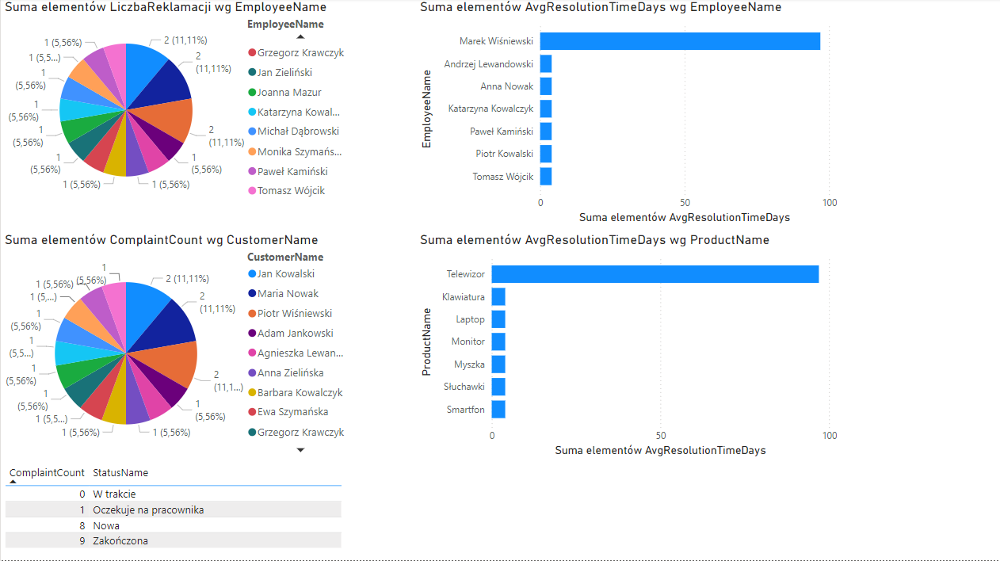

# ComplaintsDB - Dokumentacja Bazy Danych

## Spis Treści
1. [Opis Ogólny](#opis-ogólny)
2. [Tabele](#tabele)
3. [Procedury Składowane](#procedury-składowane)
4. [Triggery](#triggery)
5. [Analiza Wizualna](#analiza-wizualna)

---

## Opis Ogólny
Baza danych **ComplaintsDB** została zaprojektowana w celu zarządzania procesem obsługi reklamacji w firmie. Umożliwia rejestrowanie klientów, produktów, reklamacji i ich obsługi, a także zapewnia analizę czasu rozwiązania zgłoszeń.

---

## Tabele
### 1. PostalCodes
Przechowuje dane o kodach pocztowych i powiązanych miejscowościach.

### 2. Addresses
Reprezentuje adresy klientów, pracowników oraz dostawców.

### 3. Suppliers
Przechowuje dane o dostawcach produktów.

### 4. ResolutionTypes
Zawiera możliwe sposoby rozwiązywania reklamacji, np. naprawa, zwrot pieniędzy.

### 5. ShippingOptions
Opisuje opcje wysyłki dostępne w procesie reklamacji.

### 6. PaymentMethods
Zawiera dostępne metody płatności.

### 7. Customers
Przechowuje dane klientów składających reklamacje.

### 8. Employees
Dane pracowników zajmujących się obsługą reklamacji.

### 9. Products
Informacje o produktach objętych reklamacjami.

### 10. Complaints
Rejestruje zgłoszenia reklamacyjne.

### 11. ComplaintDetails
Szczegóły reklamacji, takie jak opis, data zgłoszenia i rozwiązania.

---

## Procedury Składowane

### Lista Procedur
1. **`usp_Insert`**  
   Dodaje nowy record do danej tabeli.
   **Parametry**:
  - W zależności od tabeli.
   
3. **`usp_UpdateComplaintStatus`**  
   Aktualizuje status reklamacji.  
   **Parametry**:
   - `@ComplaintID`: ID reklamacji.
   - `@NewStatusID`: Nowy status.

4. **`usp_DeleteComplaint`**  
   Usuwa reklamację i powiązane szczegóły.  

---

## Triggery

### Lista Triggerów
1. **`trg_IDUpdate_*`**  
   Automatycznie przypisują unikalne identyfikatory (`ID`) podczas wstawiania nowych rekordów. Dotyczy tabel:
   - `Customers`
   - `Employees`
   - `Products`
   - `Complaints`.

2. **`trg_UpdateResolutionDate`**  
   Ustawia datę rozwiązania reklamacji, gdy jej status zmienia się na "Zakończona".

---
## Analiza Wizualna

Poniżej znajduje się zrzut ekranu przedstawiający różne wizualizacje danych przygotowane w Power BI na podstawie bazy **ComplaintsDB**.

### Opis Wykresów
1. **Liczba reklamacji według pracownika**  
   Wykres kołowy pokazuje procentowy udział reklamacji obsłużonych przez każdego pracownika.

2. **Średni czas rozwiązania reklamacji według pracownika**  
   Wykres słupkowy przedstawia średni czas (w dniach) rozwiązania reklamacji przez poszczególnych pracowników.

3. **Liczba reklamacji według klientów**  
   Wykres kołowy obrazuje udział procentowy reklamacji zgłaszanych przez różnych klientów.

4. **Średni czas rozwiązania reklamacji według produktów**  
   Wykres słupkowy przedstawia średni czas rozwiązania reklamacji dla poszczególnych produktów.
   
5. **Liczba reklamacji o danym statusie**
   Tabela przedstawia ile jest reklamacji o danym statusie.

